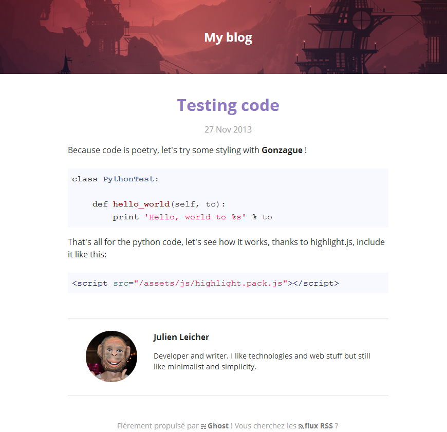

# Gonzague - Ghost theme

Gonzague is a tiny [Ghost](http://ghost.org) theme written using the [SASS](http://sass-lang.com/) preprocessor and the [Susy](http://susy.oddbird.net/) library released under the MIT License.

## Installation

Just drop or clone the gonzague folder/repo into your Ghost content/themes folder, restart ghost and choose gonzague in the configuration page of your Ghost backend!

## TODO:

- Make img responsive

## Syntax highlighting

Gonzague uses the library [highlight.js](http://highlightjs.org/) for its code syntax highlighting. The default js version included with this theme contains the "common" packages and the github color scheme. If you want more languages or themes, just head to the highlighting site and download the version you wish.